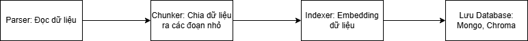
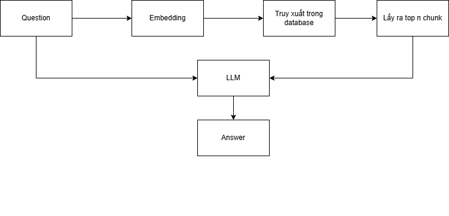

# Chatbot_QA_SSubject
* Database: MongoDB
* Vector Database: ChromaDB
* Embedding model: BAAI/bge-m3
* LLM: GeminiGemini


## PipeLine
### Index



### Query



## Cài đặt yêu cầu
Trước hết cần cài đặt các thư viện cần thiết.
```yaml
pip install -r requirements.txt
```
## Tạo file cấu hình config.yaml
Tạo file config.yaml trong thư mục dự án có dạng sau:
```yaml
model_list:
  - model_name: gemini-1.5-flash
    litellm_params:
        model: gemini/gemini-1.5-flash
        api_key: "your_API_key"

  - model_name: gemini-1.5-flash-002
    litellm_params:
        model: gemini/gemini-1.5-flash-002
        api_key: "your_API_key"

 - model_name: gemini-pro
    litellm_params:
        model: gemini/gemini-pro
        api_key: "your_API_key"

 - model_name: gemini-1.5-pro
    litellm_params:
        model: gemini/gemini-1.5-pro
        api_key: "your_API_key"

 - model_name: gemini-1.5-flash-001
    litellm_params:
        model: gemini/gemini-1.5-flash-001
        api_key: "your_API_key"
router_settings:
  num_retries: 2
  fallbacks: [{ "gemini-pro": ["gemini-1.5-flash-001", "gemini-1.5-pro", "gemini-1.5-flash", "gemini-1.5-flash-002"]}]
```
Trong đó:
* model_list: Liệt kê các mô hình AI bạn muốn sử dụng.
* router_setting: cấu hình bộ định tuyến.
* Nếu bạn muốn tìm hiểu thêm về các setting, truy cập link https://docs.litellm.ai/docs/proxy/config_settings.
## Chạy LiteLLM Proxy
Sau khi đã cài đặt và cấu hình, chạy LiteLLM bằng lệnh:
```yaml
litellm --config config.yaml
```
LiteLLM proxy có url mặc định tại cổng 4000:
```yaml
http://127.0.0.1:4000
 ```

# LiteLLM docker guide
Lưu ý:
  * Nếu như bạn dùng windows hãy chắc chắn bạn đã tải docker desktop và chạy nó.
  * Nếu bạn chưa tải docker desktop, xem video sau https://www.youtube.com/watch?v=Gh1Sgknc6Fg&t=32s để tải và tìm hiểu qua về docker.
## Pull image litellm từ docker hub
Mở terminal hoặc powershell rồi gõ dòng lệnh
```yaml
docker pull ghcr.io/berriai/litellm:main-latest
```
Sau khi pull về bạn sẽ thấy tên docker image hiện trên tab image trong docker desktop.
## Tạo file config.yaml có cấu trúc giống ở trên
## Chạy docker container
```yaml
docker run -d -p 4000:4000 -v "<đường dẫn tuyệt đối tới file config.yaml>:/app/config.yaml" --name litellm ghcr.io/berriai/litellm:main-latest --config /app/config.yaml --detailed_debug
```

Trong đó
  * docker run : Chạy container từ image
  * -d: chạy container ở chế độ nền (detached), tức là không chiếm terminal
  * -p 4000:4000: ánh xạ cổng 4000 trên máy host với cổng 4000 bên trong container, do đó có thể truy cập LiteLLM từ http://localhost:4000 trên máy
  * -v "<đường dẫn tuyệt đối tới file config.yaml>:/app/config.yaml" : file cấu hình config.yaml từ local sẽ được mount vào trong container tại vị trí app/config.yaml
  * -name litellm : đặt tên container là litellm cho dễ quản lý
  * ghcr.io/berriai/litellm:main-latest: tên của image (có thể thay bằng image id)
  * --config /app/config.yaml : Chỉ định file cấu hình LiteLLM cần sử dụng, trỏ đến file /app/config.yaml (chính là file được mount từ máy host).
  * --detailed_debug: Bật chế độ debug chi tiết, giúp hiển thị thêm thông tin khi chạy LiteLLM.


Sau khi chạy docker, bạn sẽ thấy 1 container có tên litellm đang chạy trong tab container của docker desktop.
## Chạy thử
Trước hết hãy cài đặt các thư viện cần thiết:
```yaml
pip install langchain==0.3.19
pip install langchain-community==0.3.18
pip install openai==1.66.3
```
Kiểm tra thử file config có load chính xác vào trong container không bạn hay thử chạy file api.py:
```yaml
python backend/llm/script.py
```
